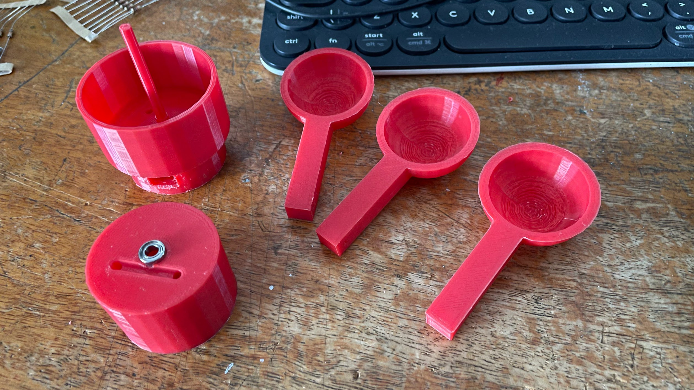

# WeatherStation

This is a my homemade weather station where I've taken inspiration from several different projects I've found online. 

## 0. Features

Done:

- Solar Powered
- Temperature sensor
- Humidity sensor
- Pressure sensor
- C02 + TVOC sensor
- Housing

To Do:

- Anemometer
- Wind direction
- Rainfall 
- Anything else?

## 1. Central Unit

I based the design of the 3D printed closure from this [project](https://www.thingiverse.com/thing:4805867), took a while to print all the parts but the finished case looks pretty cool.

### 1.1 Parts

- PLA filament
- Wemos D1 mini lite (works pretty well for my needs)
- BME280 (Temperaure, Humidity, pressure) + CCS811 (C02 + TVOC)  - [Link](https://core-electronics.com.au/sparkfun-environmental-combo-breakout-ccs811-bme280-qwiic.html)
- 5v solar panal
- PCB
- Wire
- TP4056
- 18650 battery
- Battery holder

### 1.2 Circuit

### 1.3 Code

I used ESPHome and Home Assistant to communicate between the D1 Mini and a Raspberry pi 4 to record and display the data on Home Assistant. 

### Notes
This seems to last about 2 days on a full battery, haven't fully tested in the sun yet.

## 3. Anemometer
Attempting to make my own anemometer from scratch. Used this [project](https://www.thingiverse.com/thing:2849562) as a basis for the 3D model and this [website](https://projects.raspberrypi.org/en/projects/build-your-own-weather-station/0) for the electronics basis.

### 2.1 Parts

- PLA filament
- Ball bearing ring
- Reed switch
- Small magnet
- Wire

### 2.2 Cicuit

In progress.

### 2.3 Code

Also a work in progress, anemometer scripts are what I have so far.

### Notes

1. Need to test whether the reed switch works with one connection near the magent.
2. Need to work out the maths for my specific model.
3. Otherwise it seems to somewhat work for ""normal" wind speeds, not so accurate for fast speeds. Hopefully this is fixable.

## 4. Wind Direction
## 5. Rainfall
